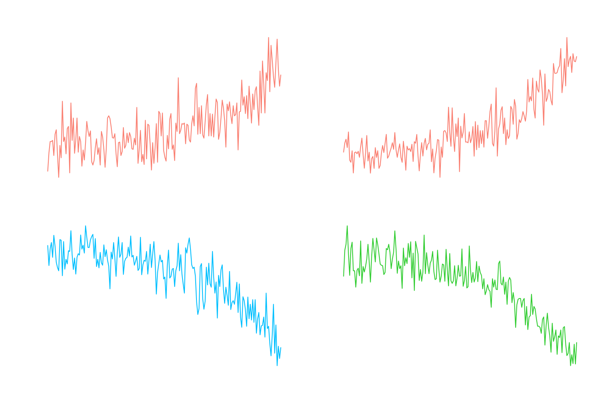
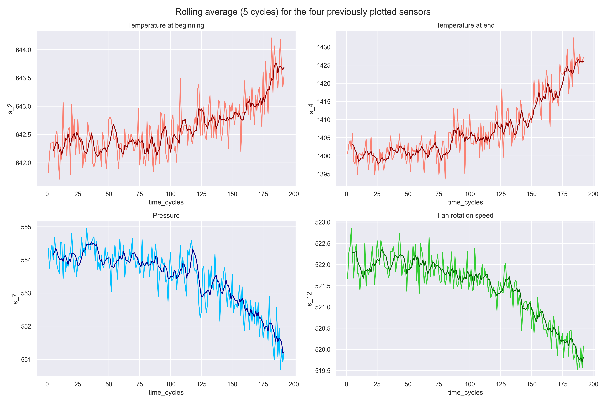
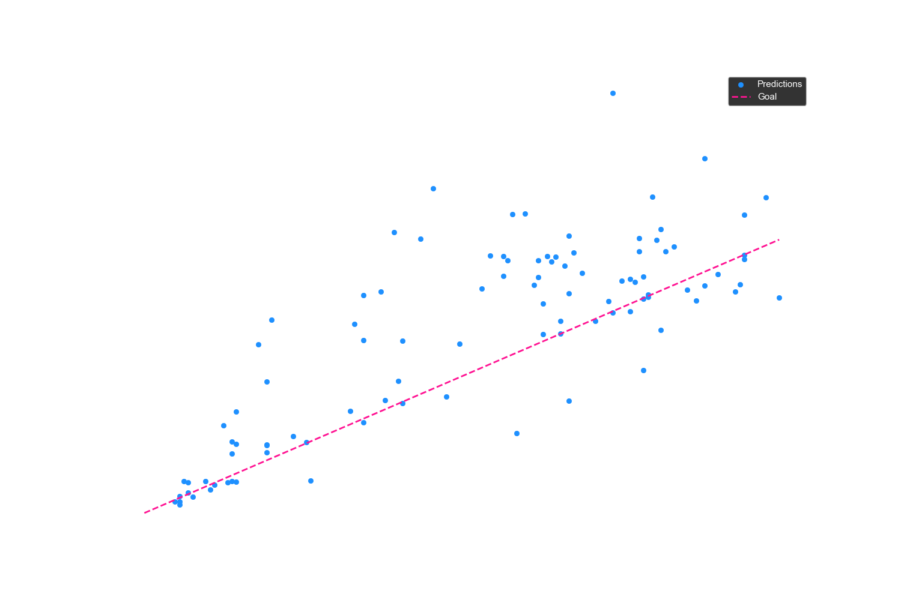
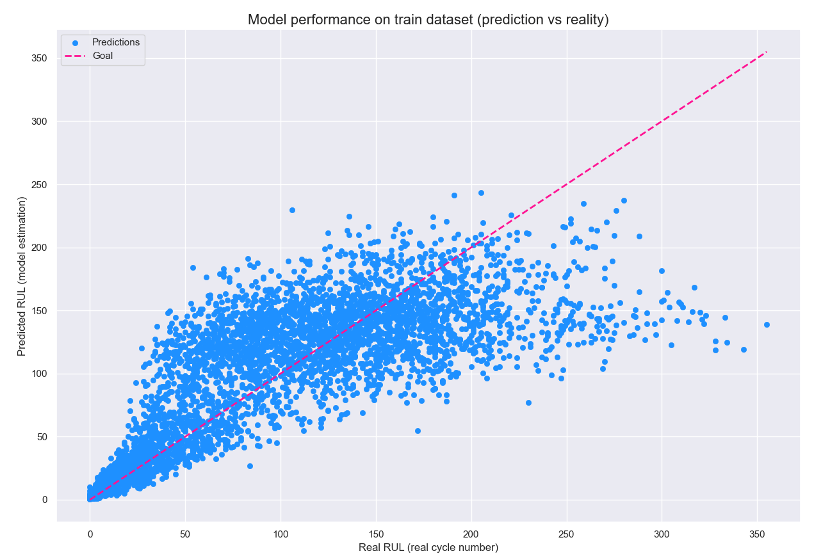

# NASA Turbofan Engine RUL prediction model
A Python machine learning project with Pandas and Scikit-learn to predict the lifespan of NASA turbojet engines  

 
Diagram from <a href="https://planenerd.com/how-many-rpm-does-jet-engine-spin/">Planenerd</a>

## Table of content

Expand contents

- [Project goal](#project-goal)
- [Results](#results)
- [How to run the calculated model](#how-to-run-the-calculated-model)
- [Credits & references](#credits--references)

## Project goal
This project uses machine learning (Random Forest) to predict the RUL (remaining useful life) of turbojet engines based on sensor data provided by the NASA C-MAPSS dataset.  

Given the history of sensor readings (temperature, pressure, fan speed, and more), the goal is to predict exactly how many flight cycles an engine has left before it breaks down

## Results
### Performance
The model was evaluated using the RMSE (root mean squared error) metric on a separated test set  

| Dataset | RMSE score | Interpretation |  
:-------:|:-------:|:-------:
| Validation set 20% | 44.76 cycles | Average performance |  
| Test set | 35.77 cycles | Good performance |  
  
The model performs exceptionally well when the engine approaches failure which is the most critical phase for maintenance decisions

### Visualization
I hypothesized about the properties of a turbofan engine to select the most relevant sensors
* Temperatures (sensors 2 and 4): rise due to efficiency loss 
* Pressure and fan speed (sensors 7 and 12): drop due to wear and tear  
  

  
   

I then applied a rolling mean with a window of 5 cycles to extract the true degradation trend and to calm the noise  

 

For the machine learning I chose a Random Forest regression for its ability to handle non-linear calculations and its robustness to noise, the prediction $\hat{y}$ for a given input $x$ is the average of the predictions of $K$ individual decision trees $T_k$:

$$\hat{y} = \frac{1}{K} \sum_{k=1}^{K} T_k(x)$$

Here I am using 100 decision trees and a fixed random generator for reproducibility  

  
   

And now the final predictions of the model on the real test set with the settings mentionned  

  
 

## How to run the calculated model
The trained model that I have calculated with this project is included in this repository as a compressed file for convenience purposes  

To use it in your own Python scripts, simply locate the file named model.zip in the root directory and extract it, you should then see a file named "rf_model_rul.pkl"

## Credits & references
Dataset: [NASA Turbofan Jet Engine Data Set](https://www.kaggle.com/datasets/behrad3d/nasa-cmaps) by behrad3d, 2019

Paper: [Damage Propagation Modeling for Aircraft Engine Run-to-Failure Simulation](https://c3.ndc.nasa.gov/dashlink/static/media/publication/2008_IEEEPHM_CMAPPSDamagePropagation.pdf) by NASA, Denver CO, Oct 2008